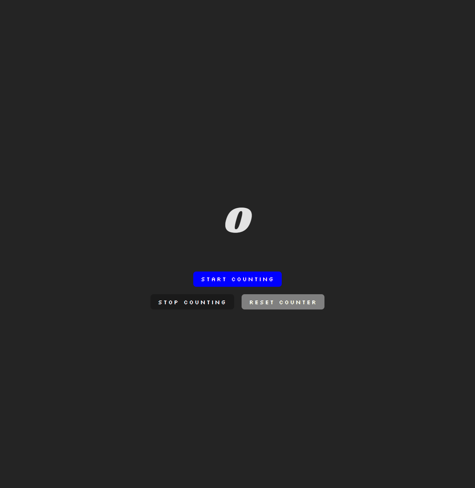

# A Simple Counter App

## Screenshot

## Description

The App displays a counter value starting from zero.
 
The counter can be started and stopped and reseted.
 
The value counts up once per second by steps of one.
 
For a visual effect, the "START COUNTING" button flashes blue and red when pressed.

## Installing and start up

Install dependencies by running the command npm install.
 
Start the program by running the command npm run dev in the terminal.

## Project details

This project is made with React+Vite and runs on localhost (http://127.0.0.1:5173/).

## Design decisions

The App is written using Hooks (New React) and it utilizes fonts from Fontsource.
 
The App is divided into components that use helpers from the utils folder.
 
The fonts are copied to App.css from Fontsource CDN page and used in the style constant in App.jsx.

## Known errors

-
